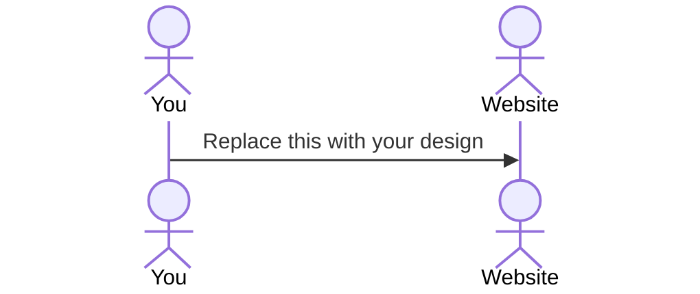

# PlanPal

[My Notes](notes.md)

Planpal is a comprehensive dailiy and weekly planner that is designed specifically for students to manage their academic, work, and personal commitments in one platform. The app features intuitive drag and drop time-block scheduling; allowings students to visually organize their day by placing tasks in time slots, with seemless sinchronization between daily and weekly calandar views. Planpal also uses intelligent color-coded catagories for classes, work, personal tasks, and heath, students to easily distinguish between the different types of commintments. Finally, Planpal also includes smart deadline tracking and an upcoming events dashboard that helps students stay aware of approaching deadlines while planning their schedule.
> [!NOTE]
>  If you are not familiar with Markdown then you should review the [documentation](https://docs.github.com/en/get-started/writing-on-github/getting-started-with-writing-and-formatting-on-github/basic-writing-and-formatting-syntax) before continuing.

## 🚀 Specification Deliverable

> [!NOTE]
>  Fill in this sections as the submission artifact for this deliverable. You can refer to this [example](https://github.com/webprogramming260/startup-example/blob/main/README.md) for inspiration.

For this deliverable I did the following. I checked the box `[x]` and added a description for things I completed.

- [ ] Proper use of Markdown
- [x] A concise and compelling elevator pitch
- [ ] Description of key features
- [ ] Description of how you will use each technology
- [ ] One or more rough sketches of your application. Images must be embedded in this file using Markdown image references.

### Elevator pitch

Balancing classes, deadlines, work, and personal life is a struggle every student faces. PlanPal solves this by combining visual time-blocking, smart deadline tracking, and comprehensive week-at-a-glance scheduling. Students can visually plan their day by dragging tasks into time blocks, and see upcoming deadlines at a glance while planning. PlanPal also uses an intelligent color-coding system to easily distinguish between classes, personal time, work, and health appointments**,** so you can see your day's balance at a glance, making PlanPal the perfect app for bringing order to the beautiful chaos of student life.

### Design

Lorem ipsum dolor sit amet, consectetur adipiscing elit, sed do eiusmod tempor incididunt ut labore et dolore magna aliqua. Ut enim ad minim veniam, quis nostrud exercitation ullamco laboris nisi ut aliquip ex ea commodo consequat. Duis aute irure dolor in reprehenderit in voluptate velit esse cillum dolore eu fugiat nulla pariatur. Excepteur sint occaecat cupidatat non proident, sunt in culpa qui officia deserunt mollit anim id est laborum.

### Key features

- 1. Interactive Daily Time-Block Planner
Visual drag-and-drop interface where students can schedule their day by dragging tasks into time slots. Shows start and finish of each activity, with color-coding by category (classes, personal, work, and health).
- 2. Integrated Weekly Calendar View
Comprehensive week-at-a-glance scheduling that syncs with the daily planner. Students can see easily plan and see what tasks should be done each day of the week. Changes made in daily view instantly update the weekly view and vice versa.
- 3. Smart Task & Deadline Manager
Flexible deadline tracker that organizes tasks by custom categories (not just classes). Features priority color-coding, time-remaining alerts, and easy filtering. Students can track everything from assignments and exams to doctor appointments and work deadlines in one unified system.
- 4. Real-Time Planning Dashboard
Live "upcoming events" panel that shows what's next while students plan their day. Automatically pulls from both scheduled items and pending deadlines, helping students make informed scheduling decisions and never miss important commitments.
- 5. Category-Based Organization System
Customizable category system that goes beyond academics. Students can create, edit, and delete categories like "Classes," "Personal," "Work," "Health," allowing the app to grow with their changing needs and responsibilities.

### Technologies

I am going to use the required technologies in the following ways.

- **HTML** - Description here
- **CSS** - Description here
- **React** - Description here
- **Service** - Description here
- **DB/Login** - Description here
- **WebSocket** - Description here

## 🚀 AWS deliverable

For this deliverable I did the following. I checked the box `[x]` and added a description for things I completed.

- [ ] **Server deployed and accessible with custom domain name** - [My server link](https://yourdomainnamehere.click).

## 🚀 HTML deliverable

For this deliverable I did the following. I checked the box `[x]` and added a description for things I completed.

- [ ] **HTML pages** - I did not complete this part of the deliverable.
- [ ] **Proper HTML element usage** - I did not complete this part of the deliverable.
- [ ] **Links** - I did not complete this part of the deliverable.
- [ ] **Text** - I did not complete this part of the deliverable.
- [ ] **3rd party API placeholder** - I did not complete this part of the deliverable.
- [ ] **Images** - I did not complete this part of the deliverable.
- [ ] **Login placeholder** - I did not complete this part of the deliverable.
- [ ] **DB data placeholder** - I did not complete this part of the deliverable.
- [ ] **WebSocket placeholder** - I did not complete this part of the deliverable.

## 🚀 CSS deliverable

For this deliverable I did the following. I checked the box `[x]` and added a description for things I completed.

- [ ] **Header, footer, and main content body** - I did not complete this part of the deliverable.
- [ ] **Navigation elements** - I did not complete this part of the deliverable.
- [ ] **Responsive to window resizing** - I did not complete this part of the deliverable.
- [ ] **Application elements** - I did not complete this part of the deliverable.
- [ ] **Application text content** - I did not complete this part of the deliverable.
- [ ] **Application images** - I did not complete this part of the deliverable.

## 🚀 React part 1: Routing deliverable

For this deliverable I did the following. I checked the box `[x]` and added a description for things I completed.

- [ ] **Bundled using Vite** - I did not complete this part of the deliverable.
- [ ] **Components** - I did not complete this part of the deliverable.
- [ ] **Router** - I did not complete this part of the deliverable.

## 🚀 React part 2: Reactivity deliverable

For this deliverable I did the following. I checked the box `[x]` and added a description for things I completed.

- [ ] **All functionality implemented or mocked out** - I did not complete this part of the deliverable.
- [ ] **Hooks** - I did not complete this part of the deliverable.

## 🚀 Service deliverable

For this deliverable I did the following. I checked the box `[x]` and added a description for things I completed.

- [ ] **Node.js/Express HTTP service** - I did not complete this part of the deliverable.
- [ ] **Static middleware for frontend** - I did not complete this part of the deliverable.
- [ ] **Calls to third party endpoints** - I did not complete this part of the deliverable.
- [ ] **Backend service endpoints** - I did not complete this part of the deliverable.
- [ ] **Frontend calls service endpoints** - I did not complete this part of the deliverable.
- [ ] **Supports registration, login, logout, and restricted endpoint** - I did not complete this part of the deliverable.

## 🚀 DB deliverable

For this deliverable I did the following. I checked the box `[x]` and added a description for things I completed.

- [ ] **Stores data in MongoDB** - I did not complete this part of the deliverable.
- [ ] **Stores credentials in MongoDB** - I did not complete this part of the deliverable.

## 🚀 WebSocket deliverable

For this deliverable I did the following. I checked the box `[x]` and added a description for things I completed.

- [ ] **Backend listens for WebSocket connection** - I did not complete this part of the deliverable.
- [ ] **Frontend makes WebSocket connection** - I did not complete this part of the deliverable.
- [ ] **Data sent over WebSocket connection** - I did not complete this part of the deliverable.
- [ ] **WebSocket data displayed** - I did not complete this part of the deliverable.
- [ ] **Application is fully functional** - I did not complete this part of the deliverable.
