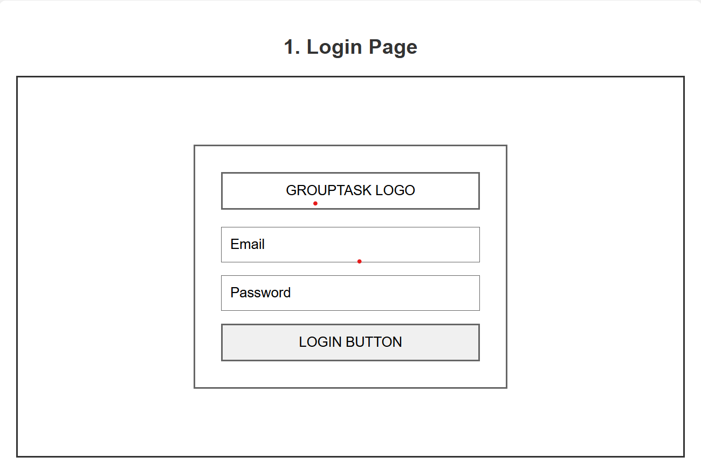
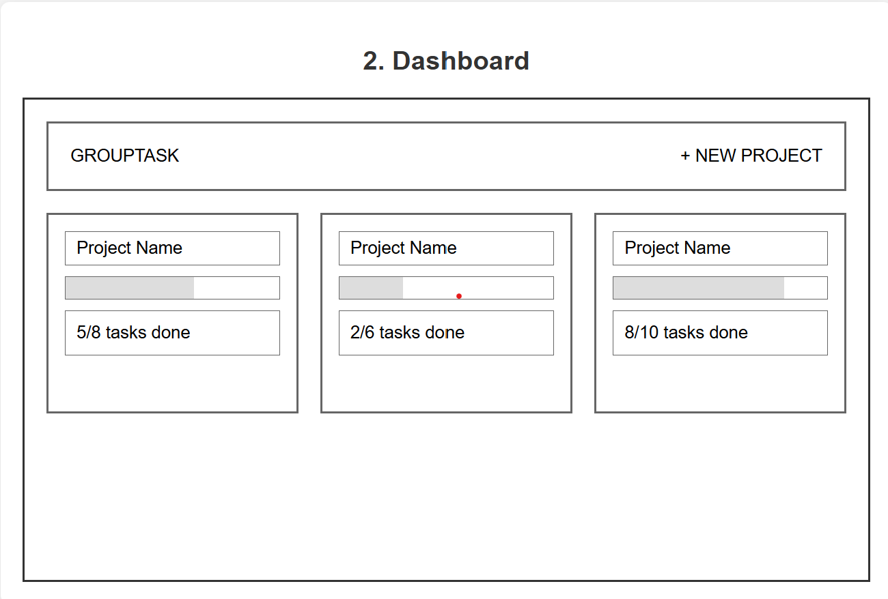
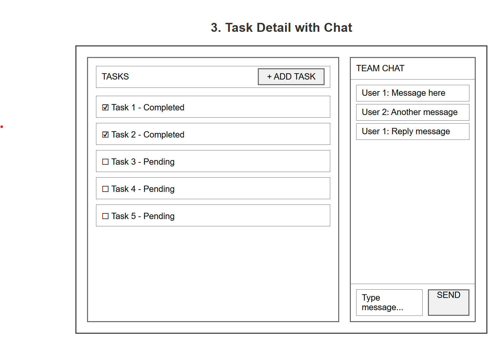

# GroupTask -The Collaborative To-Do App

GroupTask is a collaborative to-do list application that transforms individual task management into a team effort. Users can create shared projects (like "Group Presentation," "Apartment Cleaning," or "Event Planning") and invite friends, roommates, or classmates to join. Within each project, team members can add tasks, assign them to specific people, and track progress together. The key feature is real-time synchronization - when anyone marks a task complete, adds a new item, or makes changes, everyone in the group sees the updates instantly. Each project also includes a built-in chat feature for quick coordination and communication, making it perfect for group projects, household chores, event planning, or any collaborative effort that requires shared accountability.

## 🚀 Specification Deliverable
For this deliverable I did the following. I checked the box `[x]` and added a description for things I completed.

- [x] Proper use of Markdown
- [x] A concise and compelling elevator pitch
- [x] Description of key features
- [x] Description of how you will use each technology
- [x] One or more rough sketches of your application. Images must be embedded in this file using Markdown image references.

### Elevator pitch
Juggling tasks in a group project can be chaotic, with constant messages and missed updates. GroupTask solves this by providing a single, shared space for all your to-do lists. Our app allows you to create projects, assign tasks to members, and see live status updates the moment someone completes an item. It's the perfect tool to ensure everyone is on the same page and projects get done efficiently.
### Design

### Key features

- Real-time Task Updates: See when tasks are added, assigned, or completed as they happen.

- Project-based Organization: Create separate to-do lists for different teams, projects, or personal goals.

- User Authentication: Secure login and registration for all users.

- Collaborative Task Management: Assign tasks to specific team members and track their progress.

### Technologies

I am going to use the required technologies in the following ways.

- **HTML** - HTML will define what kind of content is being displayed. A task's name would be in an HTML element, as would the    
names of projects and users.

- **CSS** - CSS will be used to style GroupTask and give it a polished, visually appealing look.

- **React** - Keep track of the app's current data with different task items and various other elements in the application. It would also create key components such as a projectlist compononet to show all projects, task item component for each individual task, and a sidebar for navigation.

- **Service** - Acts as the intermediary between the front-end and the database, handling all requests for creating projects, adding tasks, and managing user data.

- **DB/Login** - A database stores all user, project, and task data. A secure login system with authentication tokens ensures only authorized users can access their information.

- **WebSocket** - The core technology for real-time functionality. It pushes live updates from the server to all connected users in a group, instantly showing when a task is completed or changed without the need to refresh the page.

## 🚀 AWS deliverable

For this deliverable I did the following. I checked the box `[x]` and added a description for things I completed.

- [X] **Server deployed and accessible with custom domain name** - [My server link](https://grouptask.click).

## 🚀 HTML deliverable

For this deliverable I did the following. I checked the box `[x]` and added a description for things I completed.

- [X] **HTML pages** - Five different pages. One for each view. `index.html` (Login), `dashboard.html`, `taskdetail.html`, `about.html` and, `chat.html`.
- [X] **Proper HTML element usage** - I spent a lot of time learning about elements. I used header, footer, main, nav, img, a, fieldset, input, button, form, and many more.
- [X] **Links** - Links between views.
- [X] **Text** - About page has text.
- [X] **3rd party API placeholder** - About page has a place to display an inspirational quote.
- [X] **Images** - Image is displayed on the about page and on the header for every page.
- [X] **Login placeholder** - Placeholder for auth on the login page.
- [X] **DB data placeholder** - The current projects will be listen in the dashboard page which will be taken from a database. For now though, I have just filled it in with some placeholders.
- [X] **WebSocket placeholder** - The chat page has a text area that will show the live message when someone is writting. The Taskdetail page will also show updates that have been made on the current project.

## 🚀 CSS deliverable

For this deliverable I did the following. I checked the box `[x]` and added a description for things I completed.

- [X] **Header, footer, and main content body** - I completed this part of the deliverable.
- [X] **Navigation elements** - I completed this part of the deliverable.
- [X] **Responsive to window resizing** - I completed this part of the deliverable.
- [X] **Application elements** - I completed this part of the deliverable.
- [X] **Application text content** - I completed this part of the deliverable.
- [X] **Application images** - I completed this part of the deliverable.

## 🚀 React part 1: Routing deliverable

For this deliverable I did the following. I checked the box `[x]` and added a description for things I completed.

- [X] **Bundled using Vite** - I completed this part of the deliverable.
- [X] **Components** - I completed this part of the deliverable.
- [X] **Router** - I completed this part of the deliverable.

## 🚀 React part 2: Reactivity deliverable

For this deliverable I did the following. I checked the box `[x]` and added a description for things I completed.

- [ ] **All functionality implemented or mocked out** - I did not complete this part of the deliverable.
- [ ] **Hooks** - I did not complete this part of the deliverable.

## 🚀 Service deliverable

For this deliverable I did the following. I checked the box `[x]` and added a description for things I completed.

- [ ] **Node.js/Express HTTP service** - I did not complete this part of the deliverable.
- [ ] **Static middleware for frontend** - I did not complete this part of the deliverable.
- [ ] **Calls to third party endpoints** - I did not complete this part of the deliverable.
- [ ] **Backend service endpoints** - I did not complete this part of the deliverable.
- [ ] **Frontend calls service endpoints** - I did not complete this part of the deliverable.
- [ ] **Supports registration, login, logout, and restricted endpoint** - I did not complete this part of the deliverable.

## 🚀 DB deliverable

For this deliverable I did the following. I checked the box `[x]` and added a description for things I completed.

- [ ] **Stores data in MongoDB** - I did not complete this part of the deliverable.
- [ ] **Stores credentials in MongoDB** - I did not complete this part of the deliverable.

## 🚀 WebSocket deliverable

For this deliverable I did the following. I checked the box `[x]` and added a description for things I completed.

- [ ] **Backend listens for WebSocket connection** - I did not complete this part of the deliverable.
- [ ] **Frontend makes WebSocket connection** - I did not complete this part of the deliverable.
- [ ] **Data sent over WebSocket connection** - I did not complete this part of the deliverable.
- [ ] **WebSocket data displayed** - I did not complete this part of the deliverable.
- [ ] **Application is fully functional** - I did not complete this part of the deliverable.
